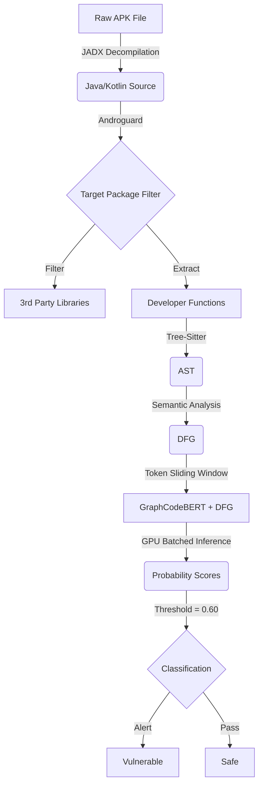
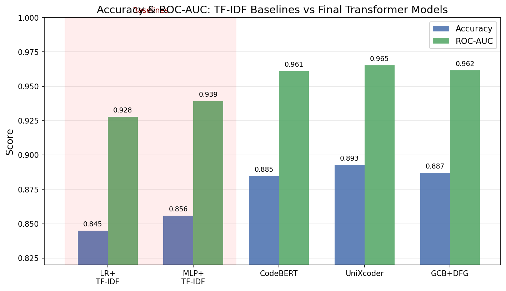
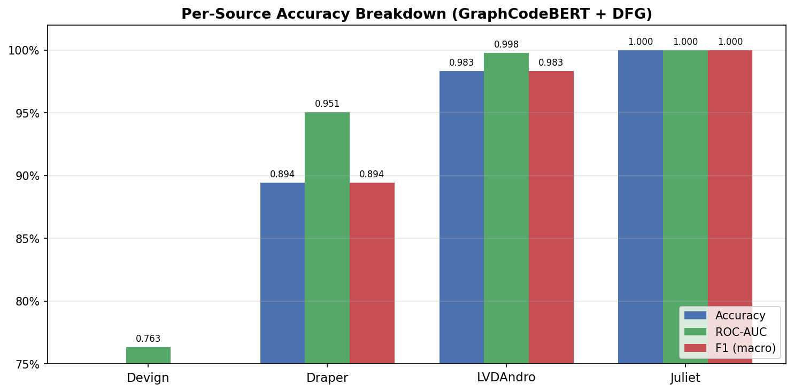
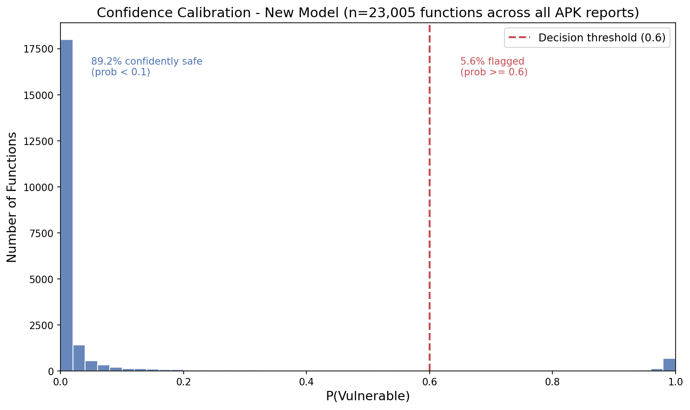
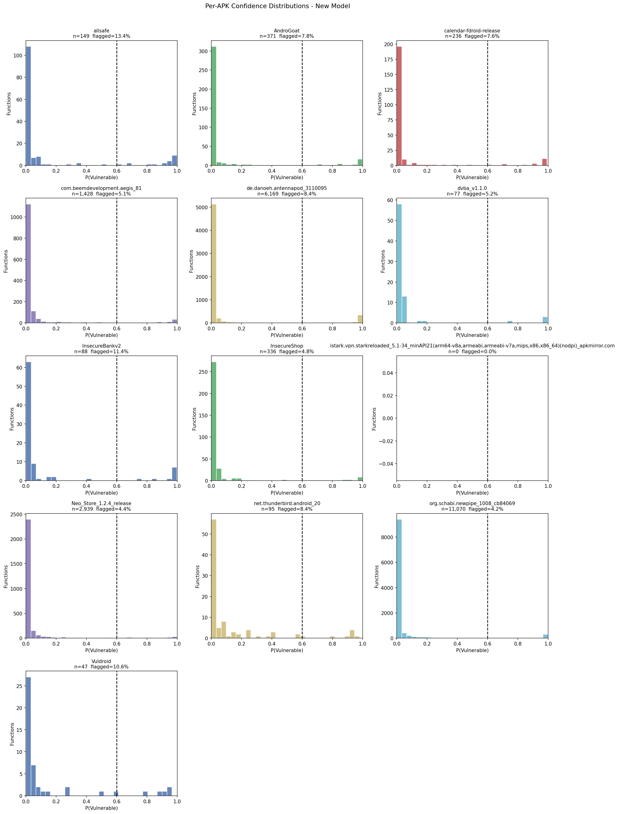

# Android APK Vulnerability Detection - Empirical Study

This project implements an end-to-end vulnerability detection system for Android applications
using **GraphCodeBERT with DFG-aware attention**, and conducts a large-scale empirical study
of whether graph structure benefits vulnerability detection on decompiled bytecode.

## Core Finding

**DFG-aware attention provides no consistent benefit over standard transformer encoding
on decompiled Android bytecode.** Across three encoder backbones (CodeBERT, GraphCodeBERT,
UniXcoder), DFG augmentation produces inconsistent results. All transformer models converge
to roughly the same 88-89% accuracy band.

**Why**: JADX decompilation strips meaningful identifier names, replacing them with
machine-generated tokens such as `class_336` and `method_1192`. DFG edges still exist,
but they connect semantically empty tokens. Text-only models therefore match or outperform
graph-augmented models on the same data.

## Three Genuine Contributions

1. **End-to-end Android APK pipeline**: first published system for DFG extraction from
   decompiled bytecode at scale across Java, Kotlin, and C/C++.
2. **200k DFG-annotated vulnerability corpus**: a large balanced dataset that does not
   currently exist elsewhere in public form.
3. **Null DFG finding with mechanistic explanation**: a negative result supported by
   controlled ablation and qualitative analysis of 1,184 false negatives.

---

## Pipeline Architecture



---

## Training Configuration

| Parameter | Value |
|---|---|
| Split | 90/10 train/test, seed 42 |
| Epochs | 3 (fixed, no checkpoint selection) |
| Batch size | 16 train / 32 eval |
| Learning rate | 2e-5 |
| Optimizer | AdamW, eps = 1e-8 |
| Gradient clipping | max norm 1.0 |
| Precision | FP16 |
| Code length | 384 tokens |
| Decision threshold | 0.60 |

---

## Results

### Table 1 - Full Model Comparison

| Model | Backbone | Structure | Accuracy | ROC-AUC | PR-AUC | FN | FP |
|---|---|---|:---:|:---:|:---:|:---:|:---:|
| LR + TF-IDF | - | None | 84.50% | 0.9277 | 0.9227 | 1,615 | - |
| MLP + TF-IDF | - | None | 85.58% | 0.9393 | 0.9374 | 1,298 | - |
| CodeBERT | codebert-base | Text only | 88.48% | 0.9610 | 0.9616 | 1,072 | 1,232 |
| CodeBERT + DFG | codebert-base | DFG attn | 88.45% | 0.9609 | 0.9616 | 1,089 | 1,221 |
| **GCB + DFG (ours)** | graphcodebert | DFG attn | **88.71%** | **0.9616** | **0.9622** | 1,184 | 1,074 |
| UniXcoder | unixcoder-base | Text only | 89.28% | 0.9652 | 0.9657 | 1,051 | 1,092 |
| UniXcoder + DFG | unixcoder-base | DFG attn | 89.40% | 0.9651 | 0.9657 | 1,043 | 1,076 |

Test set: 19,996 held-out samples.



### Table 2 - DFG Ablation

| Condition | Accuracy | ROC-AUC | PR-AUC | FN |
|---|:---:|:---:|:---:|:---:|
| GraphCodeBERT + DFG | 88.71% | 0.9616 | 0.9622 | 1,184 |
| GraphCodeBERT (no DFG) | 88.72% | 0.9612 | 0.9618 | 1,194 |
| **Delta** | **-0.01%** | **+0.0004** | **+0.0004** | **-10** |


### Table 3 - DFG Effect Per Backbone

| Backbone | Text-only | DFG-aware | Delta Accuracy | Delta FN | McNemar p-value | Verdict |
|---|:---:|:---:|:---:|:---:|:---:|---|
| CodeBERT | 88.48% | 88.45% | -0.03% | +17 | 0.8728 | Not significant |
| GraphCodeBERT | 88.72% | 88.71% | -0.01% | -10 | 0.9758 | Not significant |
| UniXcoder | 89.28% | 89.40% | +0.12% | -8 | 0.4329 | Not significant |

None of the within-backbone DFG comparisons is statistically significant in the currently
downloaded raw prediction files.

### Table 3b - Additional Significance Checks

| Comparison | Delta Accuracy | McNemar p-value | Verdict |
|---|:---:|:---:|---|
| GCB + DFG vs GCB no-DFG | -0.0100% | 0.9758 | Not significant |
| CodeBERT + DFG vs CodeBERT text | -0.0300% | 0.8728 | Not significant |
| UniXcoder + DFG vs UniXcoder text | +0.1200% | 0.4329 | Not significant |
| GCB + DFG vs UniXcoder + DFG | -0.6951% | 0.0002 | Significant |

Raw significance details are saved in `results/test9_significance_results.txt`.

### Table 4 - Training Stability

| | Accuracy | ROC-AUC |
|---|:---:|:---:|
| **mean +- std** | **87.53% +- 0.11%** | **0.9565 +- 0.0003** |


### Table 5 - Per-Source Breakdown

| Source | N | Accuracy | ROC-AUC | FN |
|---|:---:|:---:|:---:|:---:|
| **LVDAndro** | 7,537 | **98.34%** | **0.9978** | **51** |
| Draper | 7,449 | 89.43% | 0.9507 | 439 |
| Juliet | 2,533 | 100.00% | 1.0000 | 0 |
| Devign | 2,477 | 67.58% | 0.7633 | 449 |



### Table 6 - Deployment Threshold

| Threshold | Recall | F1 | FPR | FN |
|---|:---:|:---:|:---:|:---:|
| 0.50 | 87.24% | 0.6165 | 10.64% | 143 |
| **0.60** | **83.41%** | **0.6585** | **7.77%** | **186** |
| 0.65 | 81.71% | 0.6760 | 6.67% | 205 |


### ROC and PR Curves


### Real-World APK Scanner Calibration

Calibration was re-run with the standalone script `test_c_calibration_newmodel.py`
across all downloaded scanner reports.

| Aggregate metric | Value |
|---|---:|
| APK reports analysed | 13 |
| Total functions | 23,005 |
| Below 0.10 | 89.2% |
| Between 0.10 and 0.60 | 5.2% |
| At or above 0.60 | 5.6% |
| Above 0.90 | 4.1% |

The distribution is sharply concentrated near 0.0 with a small high-confidence tail rather
than being flat or centered near 0.5.





| APK | Type | Functions | Flagged | Rate |
|---|---|:---:|:---:|:---:|
| allsafe | Safe test app | 149 | 20 | 13.4% |
| AndroGoat | Deliberately vulnerable | 371 | 29 | 7.8% |
| calendar-fdroid-release | FOSS app | 236 | 18 | 7.6% |
| com.beemdevelopment.aegis | FOSS 2FA | 1,428 | 73 | 5.1% |
| de.danoeh.antennapod | FOSS podcast | 6,169 | 519 | 8.4% |
| dvba_v1.1.0 | Deliberately vulnerable | 77 | 4 | 5.2% |
| InsecureBankv2 | Deliberately vulnerable | 88 | 10 | 11.4% |
| InsecureShop | Intentionally vulnerable | 336 | 16 | 4.8% |
| istark.vpn.starkreloaded | Commercial APK sample | 0 | 0 | 0.0% |
| Neo_Store_1.2.4_release | FOSS app | 2,939 | 128 | 4.4% |
| net.thunderbird.android_20 | FOSS email | 95 | 8 | 8.4% |
| org.schabi.newpipe_1008_cb84069 | FOSS media | 11,070 | 463 | 4.2% |
| Vuldroid | Deliberately vulnerable | 47 | 5 | 10.6% |

### False Negative Pattern Classification

| Pattern | Description | Count |
|---|---|:---:|
| P5a | Full machine-generated obfuscation | 5 |
| P1 | Structural fragmentation | 4 |
| P5b | Kotlin/lambda synthetic obfuscation | 3 |
| P7 | Inter-procedural access patterns | 3 |
| P2 | Benign surface appearance | 2 |
| P3 | Arithmetic edge case | 1 |
| P6 | Flag/control flow logic | 1 |
| P4 | Android API semantic bypass | 1 |

---

## Project Structure

| File | Role |
|---|---|
| `training-notebooks/` | Backbone training notebooks |
| `test-notebooks/test-2-roc-auc.ipynb` | ROC-AUC / PR-AUC curves |
| `test-notebooks/test-3-ablation.ipynb` | Controlled DFG ablation |
| `test-notebooks/test_4_multiseed.ipynb` | Training stability |
| `test-notebooks/test-5-per-source.ipynb` | Per-source accuracy |
| `test-notebooks/test-6-mlp-baseline.ipynb` | MLP/TF-IDF baseline |
| `test-notebooks/test-7-imbalanced-eval.ipynb` | Threshold calibration |
| `test-notebooks/test-8-qualitative-analysis.ipynb` | FN pattern analysis |
| `test-notebooks/test-9-significance-testing.ipynb` | Kaggle significance notebook |
| `scanner-notebooks/` | End-to-end scanner notebook(s) |
| `scripts/calculate_significance.py` | McNemar significance testing on saved arrays |
| `scripts/test_c_calibration_newmodel.py` | Calibration plots from downloaded APK JSON reports |
| `arrays/` | Saved probability and label `.npy` files |
| `apk-reports/` | Scanner JSON reports from APK runs |
| `tools/` | Local helper runtime and installer files |
| `results/` | Generated result text files and figures |

---

## Reproducing Results

```powershell
C:\Users\User\Downloads\Transformer-APK-Defense\tools\python312\python.exe scripts\calculate_significance.py
C:\Users\User\Downloads\Transformer-APK-Defense\tools\python312\python.exe scripts\test_c_calibration_newmodel.py
```

All training notebooks are self-contained. Upload to Kaggle GPU, attach
`dataset_graphcodebert.jsonl`, and run with identical hyperparameters.
