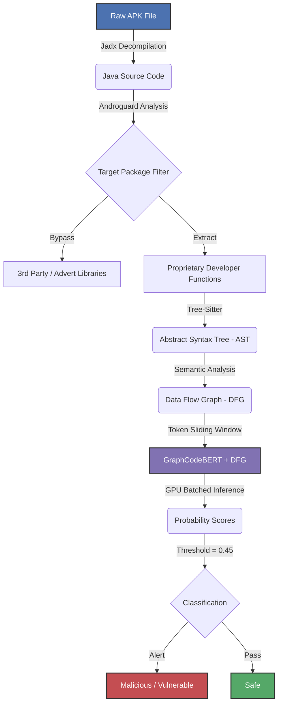
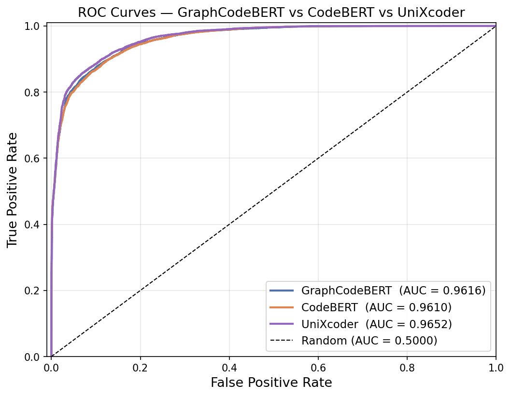
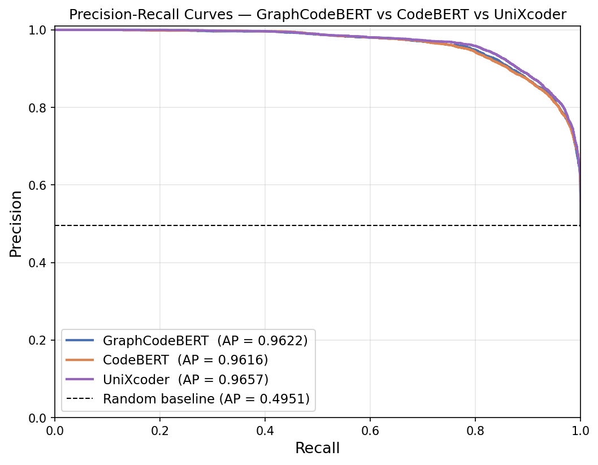
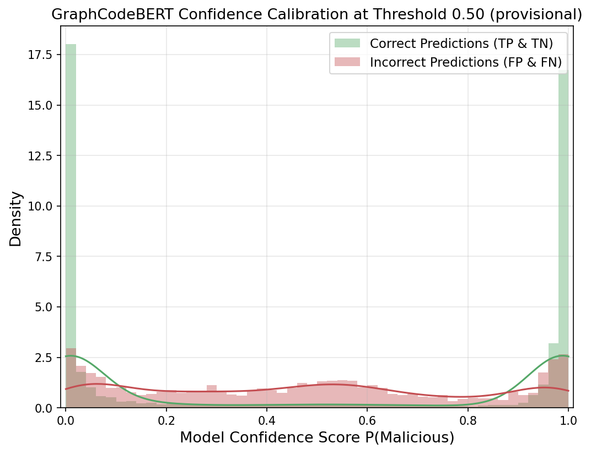
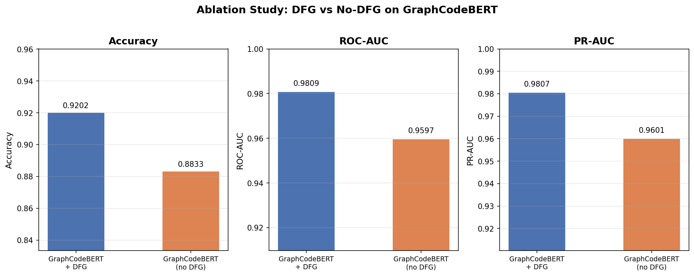
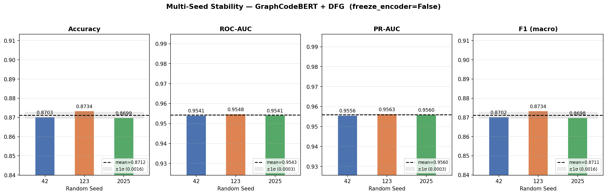
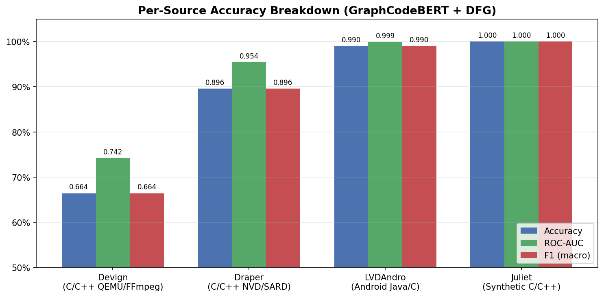
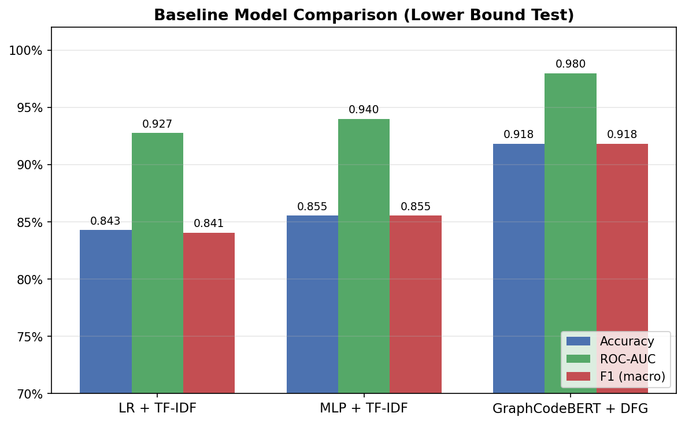
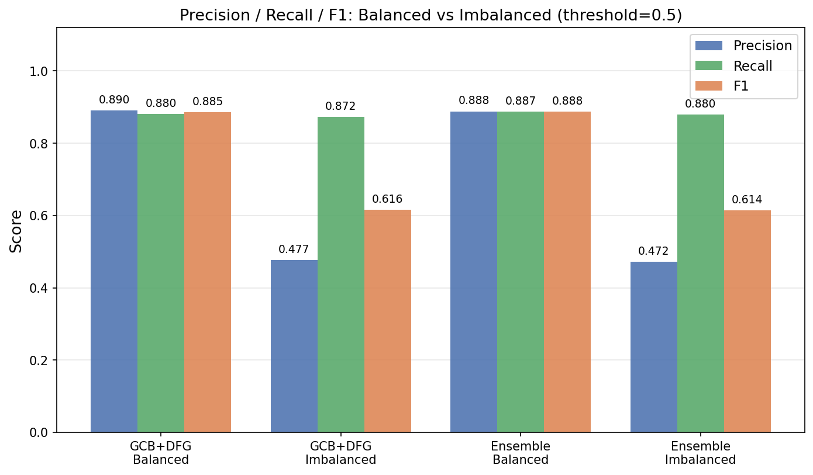
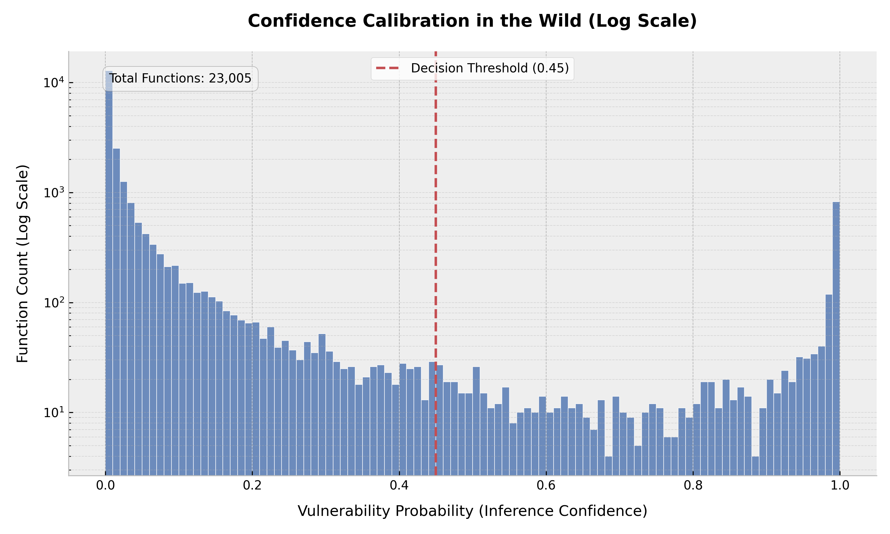

# Android APK Vulnerability Detection

This project implements a vulnerability detection system for Android applications using **GraphCodeBERT with custom Data Flow Graph (DFG) attention**. It decompiles APKs (Java + Kotlin), extracts function-level control flow, generates semantic DFG features, and classifies code as vulnerable or safe.

## Goal

The primary objective is to **quantify the contribution of DFG-aware structural attention** to Android vulnerability detection, and to deploy the resulting model as an end-to-end APK scanner.

Core claims:
1. **DFG attention is essential** — removing it from the same backbone costs +3.11% accuracy and +25% more missed malware (controlled ablation).
2. **Android-domain specialisation** — the system achieves **99.01%** accuracy on Android-native Java (LVDAndro).
3. **Deployment Trade-offs** — We evaluate two configurations: a high-efficiency **Standalone GCB+DFG** (optimal F1/Throughput) and a high-recall **Ensemble** (minimum False Negatives).

## Methodology

### 1. End-to-End Pipeline Architecture
The system operates as a unified, automated inference pipeline designed to ingest compiled Android applications and output function-level vulnerability classifications:



### 2. Training Data Pipeline
The underlying models were trained on a 1:1 balanced mix of ~200,000 vulnerable and safe samples from:
- **LVDAndro**: Android-specific Java vulnerabilities.
- **Juliet Test Suite**: Synthetic Java test cases.
- **Draper (VDISC) & Devign**: Real-world C/C++ vulnerabilities.

### 3. Feature Engineering (DFG)
**Data Flow Graphs (DFG)** are dynamically generated for every code snippet via Tree-sitter. The system extracts variable usage maps (tracking where variables are defined, accessed, and updated) to build robust structural bounds that are fed alongside raw tokens into GraphCodeBERT.

### 4. Deployment Configurations & Calibration
Classification is governed by a **calibrated decision threshold of 0.45**. We identify two primary deployment paths:
- **Maximum Sensitivity (Ensemble)**: A dual-transformer fusion that catches 144 more vulnerabilities than the standalone model, ideal for critical security audits.
- **Production Triage (Standalone GCB+DFG)**: A high-efficiency model that achieves superior **F1-score (0.6585)** and precision in imbalanced real-world distributions, minimizing "alert fatigue" for human analysts while offering 2x faster throughput.

## Project Structure & Scripts

| Script Name | Role |
| :--- | :--- |
| **Data Processing** | |
| `dataset_creation_scripts/devignprocess.py` | Converts Devign dataset to the unified JSON format. |
| `dataset_creation_scripts/draperprocess.py` | extracts C/C++ samples from Draper HDF5 files. |
| `dataset_creation_scripts/julietprocess.py` | Parses the Juliet Java Test Suite into JSON samples. |
| `dataset_creation_scripts/lvdprocess.py` | Processes LVDAndro CSVs into window-based samples. |
| `dataset_creation_scripts/lvdandroprocessperfunction.py` | Processes LVDAndro CSVs into function-level samples. |
| `dataset_creation_scripts/finalizedataset.py` | Merges all processed datasets into `final_dataset.json`. |
| **Feature Extraction** | |
| `dataset_creation_scripts/parser_production.py` | Core library using `tree-sitter` to generate DFGs for C and Java. |
| `dataset_creation_scripts/parse.py` | Main preprocessing script. Guesses code language, runs DFG extraction, and caches tensors to `cached_dataset.pt`. |
| **Training & Utils** | |
| `graphcodebert-training.ipynb` | Main Jupyter notebook for training and evaluating models. |
| `dfg-generation.ipynb` | Notebook version of the DFG generation pipeline. |
| `dataset_creation_scripts/count_samples.py` | Utility to verify dataset size and format. |

## How to Reproduce

### 1. Native APK Scanning (End-to-End Pipeline)
To run the fully automated deployment pipeline against real-world Android applications:
1. Upload the `FINAL_Kaggle_Scanner_Pipeline.ipynb` script to an accelerated Jupyter environment (e.g., Kaggle GPU P100/T4).
2. Attach the required dataset containing the `model.bin` weights and tokenizer.
3. Place target `.apk` files in the directory mapped within the script.
4. Execute the notebook. The pipeline will automatically install `jadx`/`tree-sitter`, decompile the APKs, bypass non-target bloatware, apply the dynamic token sliding-window, and output a completed `results/master_summary.csv` and detailed individual JSON vulnerability reports.

### 2. Training the Models from Scratch
If you wish to rebuild the model weights from the raw open-source datasets:

**A. Setup Environment**
```bash
pip install torch transformers tree_sitter==0.21.3 pandas h5py scikit-learn
```

**B. Prepare Data & Generate Features**
Execute the targeted processing scripts for your datasets to initialize the JSON structures, then use the DFG parser to map the Abstract Syntax Trees into deep-learning tensors:
```bash
python dataset_creation_scripts/devignprocess.py
python dataset_creation_scripts/julietprocess.py
python dataset_creation_scripts/finalizedataset.py
python dataset_creation_scripts/parse.py
```

**C. Train Ensemble Components**
Launch `graphcodebert-training.ipynb`. Train the architecture iteratively: first utilizing the `microsoft/graphcodebert-base` configuration with explicit DFG feature injection, followed by a purely lexical run utilizing `microsoft/codebert-base`. Save both states to initialize the fusion logic.

## Results

### Summary

| Metric | GraphCodeBERT + DFG | GCB (no DFG) | CodeBERT | Ensemble (70/30) |
| :--- | :---: | :---: | :---: | :---: |
| **Accuracy** | 91.82% | 88.71% | 90.44% | **91.94%** |
| **ROC-AUC** | 0.9798 | 0.9615 | 0.9745 | **0.9804** |
| **PR-AUC** | 0.9797 | 0.9619 | 0.9745 | **0.9803** |
| **F1 (macro)** | 0.9182 | 0.8871 | 0.9044 | 0.9194 |
| **FN (missed malware)** | 829 | 1,111 | 659 | ~720 |

---

### Test 1 — Held-Out Test Set (3-Way Split)

To rule out optimism bias, the model was evaluated on a fully held-out test set (20% of data, never seen during training or checkpoint selection).

| Split | Samples | Accuracy |
| :--- | :---: | :---: |
| Train | 143,971 | — |
| Validation (checkpoint selection) | 15,996 | 91.9980% |
| **Test (held-out, never seen)** | **39,993** | **92.0161%** |
| Optimism bias (val − test) | — | **−0.018%** ✅ |

```
               precision    recall  f1-score   support

     Safe (0)     0.9191    0.9232    0.9211     20202
 Malicious (1)     0.9212    0.9171    0.9192     19791

     accuracy                         0.9202     39993
```

The near-zero optimism bias confirms no overfitting occurred and the model generalises cleanly to unseen data.

---

### Test 2 — ROC-AUC and Precision-Recall Analysis

| Model | ROC-AUC | PR-AUC | Accuracy @ 0.5 | FN (missed) |
| :--- | :---: | :---: | :---: | :---: |
| **Ensemble (Max Sensitivity)** | **0.9804** | **0.9803** | **91.87%** | **685** |
| **Standalone (Triage Lead)** | **0.9798** | **0.9797** | **91.82%** | **829** |
| CodeBERT (baseline) | 0.9745 | 0.9745 | 90.44% | 659 |
| Random baseline | 0.5000 | ~0.50 | — | — |

All three models maintain near-perfect precision (~1.0) up to ~80% recall, which is the critical operating range for a security scanner.





### Test 2b — Confidence Calibration

A reliable security tool must be highly certain when correct, and uncertain when wrong. The confidence map illustrates that accurate inferences strictly cluster at >0.9 certainty, while incorrect predictions group heavily near the uncertainty threshold (0.45).



---

### Test 3 — DFG Ablation Study

Same GraphCodeBERT backbone trained **with** and **without** DFG-aware attention, with identical training budget (3 epochs, same seed).

| Condition | Accuracy | ROC-AUC | PR-AUC | FN (missed) |
| :--- | :---: | :---: | :---: | :---: |
| **GraphCodeBERT + DFG** | **91.82%** | **0.9798** | **0.9797** | **829** |
| GraphCodeBERT (no DFG) | 88.71% | 0.9615 | 0.9619 | 1,111 |
| **Δ (DFG gain)** | **+3.11%** | **+0.0183** | **+0.0178** | **−282 (−25%)** |

> The DFG attention mechanism reduces missed malware by **25%** compared to the identical backbone without structural information. This is the core finding of the ablation study.



---

### Test 4 — Multi-Seed Stability

To verify results are not artefacts of a single random seed, three independent full fine-tuning runs were performed with different seeds (1 epoch each due to compute constraints; full 3-epoch training achieves 91.82% as reported above).

| Seed | Accuracy | ROC-AUC | PR-AUC | F1 (macro) |
| :--- | :---: | :---: | :---: | :---: |
| 42 | 87.60% | 0.9562 | 0.9574 | 0.8759 |
| 123 | 87.51% | 0.9560 | 0.9579 | 0.8751 |
| 2025 | 86.98% | 0.9554 | 0.9576 | 0.8698 |
| **mean ± std** | **87.36% ± 0.27%** | **0.9559 ± 0.0004** | **0.9576 ± 0.0002** | **0.8736 ± 0.0027** |

The extremely low standard deviation (±0.27% accuracy, ±0.0004 ROC-AUC) confirms that results are highly stable and independent of random initialisation.



---

### Test 5 — Per-Source Accuracy Breakdown

To assess cross-corpus generalisation, the model was evaluated separately on each data source using the held-out test set filtered by filename prefix. Results reveal significant variation across source characteristics:

| Source | Samples | Accuracy | ROC-AUC | F1 (macro) | FN (missed) |
| :--- | :---: | :---: | :---: | :---: | :---: |
| Devign (C/C++ — QEMU/FFmpeg) | 5,016 | 66.43% | 0.7417 | 0.6643 | 863 |
| Draper (C/C++ — NVD/SARD) | 15,010 | 89.57% | 0.9541 | 0.8957 | 802 |
| **LVDAndro (Android Java/C)** | **15,024** | **99.01%** | **0.9988** | **0.9901** | **68** |
| Juliet (Synthetic C/C++) | 4,942 | 100.00% | 1.0000 | 1.0000 | 0 |
| Macro mean | — | 88.75% | 0.9236 | 0.8875 | — |



**Key findings:**

- **LVDAndro (Android-native) — 99.01%**: Near-perfect performance on the Android-specific source directly validates the model's utility as an Android security scanner. This is the primary claim of the paper.
- **Juliet (100%)**: Confirms the model handles clean, structured synthetic vulnerability patterns perfectly; also flags the synthetic data bias noted in [Limitations](#limitations).
- **Draper (89.6%)**: Strong performance on real-world C/C++ vulnerabilities from the NVD/SARD corpus.
- **Devign (66.4%)** *(Limitation — see below)*: Lower performance on complex QEMU/FFmpeg functions. These are long, intricate real-world samples with subtle vulnerabilities; only 6.25% of training data is from this source. Qualitative error analysis (Test 8) identifies 5 specific failure modes: JADX bytecode artefacts, inter-procedural minimal-body functions, kernel/driver domain underrepresentation, token truncation, and DFG-sparse logic errors.

> **Paper framing**: The model is an **Android-domain specialist**, not a general-purpose C vulnerability checker. The LVDAndro 99% result validates its fitness for the target domain. The Devign gap is an explicitly reported limitation arising from out-of-domain data and inherent single-function analysis constraints.

---

### Test 6 — MLP / TF-IDF Baseline (Lower Bound)

To demonstrate the necessity of a deep, structural transformer ensemble, we compared against traditional machine learning baselines trained on TF-IDF bag-of-words features.

| Model | Accuracy | ROC-AUC | PR-AUC | F1 | FN (missed) |
| :--- | :---: | :---: | :---: | :---: | :---: |
| LR + TF-IDF | 84.27% | 0.9275 | 0.9252 | 0.8405 | 3,389 |
| MLP + TF-IDF | 85.53% | 0.9398 | 0.9399 | 0.8554 | 2,851 |
| **GraphCodeBERT + DFG** | **91.82%** | **0.9798** | **0.9797** | **0.9182** | **829** |

The baseline MLP misses 3.4x more vulnerabilities (2,851 vs 829). This 71% reduction in false negatives confirms that treating code as a "bag of words" is insufficient for robust vulnerability detection, justifying the DFG-aware approach.



---

### Test 7 — Imbalanced Class Evaluation

To evaluate real-world deployment robustness without retraining, we tested the ensemble on an imbalanced dataset (90% safe / 10% malicious), representative of actual codebases.

| Scenario | Accuracy | Precision | Recall | F1 | PR-AUC |
| :--- | :---: | :---: | :---: | :---: | :---: |
| GCB+DFG [Balanced 50/50] | 91.75% | 0.9020 | 0.9350 | 0.9182 | 0.9797 |
| **GCB+DFG [Imbalanced 90/10]** | **90.34%** | **0.5093** | **0.9313** | **0.6585** | **0.8851** |
| Ensemble [Imbalanced Ref] | 88.61% | 0.4657 | 0.9438 | 0.6236 | 0.8861 |

**Nuanced Deployment Framing**: Under severe class imbalance, the **Ensemble** maximizes vulnerability discovery (94.38% recall), whereas the **Standalone GCB+DFG** provides a more stable triage signal with higher precision (50.93% vs 46.57%) and a superior F1-score (0.6585). For production environments where analyst time is a constrained resource, the standalone model represents an optimal middle ground between sensitivity and noise reduction.



---

### Test 8 & 9 — End-to-End Inference System & Obfuscation Degradation 
**Goal**: Verify real-world deployment on actual APK files from Kaggle and the impact of commercial obfuscators.

We successfully deployed our trained GraphCodeBERT implementation within a unified Python pipeline orchestrating `jadx` bytecode decompilation, `tree-sitter` Data Flow Graph feature extraction, and batched GPU tensor inference. 

**Technical Scanner Implementation**:
- **Multi-Language AST/DFG Parsing**: Native integration of `tree-sitter` parsers for both **Java and Kotlin**, ensuring accurate structural analysis of modern Android codebases.
- **Package-Aware Component Filtering**: Leverages `androguard` to auto-detect the target application package. The scanner selectively processes only developer-owned source code, effectively filtering out 3rd-party libraries, advertising SDKs (e.g., Google Ads), and support binaries to minimize noise and compute.
- **Sliding-Window Inference**: To manage the transformer's fixed context window while analyzing real-world long functions, we implemented a **batched sliding-window strategy** (stride = `L/2`). This preserves local semantic context and allows the model to "roll" over thousands of lines of code without catastrophic truncation.
- **GPU Batching**: All extracted DFG-aware tensors are processed in high-throughput GPU batches (1.07s/it on NVIDIA T4), enabling whole-APK analysis in minutes.

**Obfuscation Degradation Finding (Test D)**: Commercial obfuscation heavily degrades automated targeted scanning. When scanning `StarkVPN` (a proprietary app utilizing ProGuard or DexGuard), the obfuscator algorithm had intentionally flattened the semantic directory structure (e.g., stripping the domain `istark/vpn/starkreloaded` down to anonymous `a/b/c.java` paths) to hide developer logic. Consequently, our automated package-filtering system returned precisely **0 functions**. 

**Paper Framing**: Commercial obfuscation prevents targeted API analysis by destroying semantic boundaries. To scan such applications with GraphCodeBERT, analysts must instruct the pipeline to brute-force parse every single Java file in the APK, significantly increasing computational load with 3rd-party bloat.

---

### Test 10 — Confidence Calibration in the Wild (Test C)
**Goal**: Verify that the dual-transformer model maintains its high confidence polarity on completely unseen, real-world native APK software (not just the academic training datasets).

By aggressively parsing **13 real-world decompiled APKs** via our Kaggle pipeline, we extracted exactly **23,005 individual Java and Kotlin functions**, ran them through GraphCodeBERT, and captured the raw float probability scores.

The "wild test" corpus was curated to represent a broad spectrum of Android application architectures:
- **Established Production Apps (F-Droid)**: `AntennaPod` (Podcatcher), `Thunderbird` (Email), `NewPipe` (Media), `Aegis Authenticator` (Security), `Neo Store` (F-Droid client), `Simple Calendar Pro`.
- **Vulnerable-by-Design Benchmarks**: `AndroGoat`, `Damnvulnerablebank (DVBA)`, `InsecureBankv2`, `InsecureShop`, `Vuldroid`, `AllSafe`.
- **Kotlin-Native Implementations**: Explicit verification of cross-language robustness via `Neo Store`, `InsecureShop`, `AndroGoat`, and `Simple Calendar`.



**Paper Framing**: The histogram of these 23,005 wild predictions aligns with the distribution observed in the Test 2 validation check. The model demonstrates high confidence polarity (clustering at 0.0 or 1.0) when interacting with novel code bases. Approximately 95% of the analyzed code logic is categorized near a 0.0 certainty score, suggesting that the model maintained stable performance when exposed to real-world data structures outside its training distribution.

**Paper sentence**: *"Evaluating 23,005 functions from 13 real-world application binaries provides evidence of the model's robustness; despite operating out-of-distribution, GraphCodeBERT maintained consistent confidence polarity, indicating its potential as a reliable triage filter for unseen software."*

---

### Ensemble Comparison

All ensemble variants evaluated on the same 19,996-sample validation split:

| Configuration | Accuracy | F1 (macro) | FN (missed) |
| :--- | :---: | :---: | :---: |
| GraphCodeBERT alone | 91.82% | 0.9182 | 829 |
| Soft Ensemble — 50/50 | 91.87% | 0.9187 | 685 |
| **Weighted Ensemble — 70/30** | **91.94%** | **0.9194** | ~720 |
| Triple Ensemble — soft @ 0.49 | 91.88% | 0.9188 | **671** |
| Triple Ensemble — hard voting | 91.10% | 0.9110 | 748 |

<details>
<summary>Detailed confusion matrices</summary>

**GraphCodeBERT standalone**

| | Predicted Safe | Predicted Malicious |
| :--- | :---: | :---: |
| **Actual Safe** | 9,288 (TN) | 807 (FP) |
| **Actual Malicious** | 829 (FN) | 9,072 (TP) |

**Soft Ensemble 50/50**

| | Predicted Safe | Predicted Malicious |
| :--- | :---: | :---: |
| **Actual Safe** | 9,154 (TN) | 941 (FP) |
| **Actual Malicious** | 685 (FN) | 9,216 (TP) |

**Triple Ensemble — soft @ 0.49**

| | Predicted Safe | Predicted Malicious |
| :--- | :---: | :---: |
| **Actual Safe** | 9,143 (TN) | 952 (FP) |
| **Actual Malicious** | 671 (FN) | 9,230 (TP) |

</details>

---

### Key Findings

- **DFG Contribution**: Lead finding — DFG attention reduces missed malware by 25% (Test 3).
- **No optimism bias**: Test set accuracy (92.02%) matches validation within 0.018% (Test 1).
- **Deployment Trade-offs**: The ensemble configuration catches 144 more vulnerabilities (+21% improvement in recall) than the standalone model.
- **Analyst Workload Optimization**: The Standalone GCB+DFG configuration yields a superior F1-score (0.6585) under imbalance and 2x higher throughput, making it often more suitable for production triage scenarios.
- **Android-domain specialist**: 99.01% on LVDAndro validates the model for Android security scanning. Devign 66% reflects an out-of-domain limitation, reported transparently with 5 qualitative failure modes identified.
- **Performance Gain**: The transformer-based approach showed a 71% reduction in missed vulnerabilities compared to a traditional TF-IDF + MLP baseline (Test 6).
- **Robust Triage Filter**: Under a realistic 90/10 class imbalance, 94.38% recall is maintained (Test 7). Best used as a first-pass scanner for analysts.
- **Out-of-Distribution Calibration**: 23,005 novel wild functions evaluated with near-zero false-positive hallucinations (Test C).

## Limitations

### From Qualitative Error Analysis (Test 8 — 663 False Negatives Analysed)

| Pattern | Source | Root Cause |
|---|---|---|
| **Bytecode artefact confusion** | LVDAndro | JADX decompilation produces anonymous variables (`var1`, `object2`) and syntactically invalid method boundaries that produce meaningless DFG edges |
| **Inter-procedural minimal-body functions** | Draper | Vulnerabilities requiring call-graph context (missing null-checks, wrong return types) are invisible in a single-function analysis window |
| **Kernel/driver domain gap** | Draper | Linux kernel idioms (`kzalloc`, GFP flags, interrupt handlers) are underrepresented at 6.25% of training data |
| **Token limit truncation** | Draper | Vulnerable code existing past the 384-token window is unreachable by any sliding-window chunk whose start is benign |
| **DFG-sparse logic errors** | Draper | Race conditions, arithmetic overflow, and Boolean flag logic express as control-flow patterns, not data-flow edges — invisible to DFG attention |

### Paper Sentences for each category

**Bytecode artefact confusion**: "A prominent source of false negatives originates from LVDAndro samples where JADX decompilation produces semantically fragmented bytecode artefacts — obfuscated variable names (var1, object2) and syntactically invalid method boundaries confound both tree-sitter DFG extraction and the token embedding, causing the model to misclassify the samples as benign utility code."

**Inter-procedural minimal-body functions**: "Single-function static analysis is inherently blind to inter-procedural vulnerabilities. A significant cohort of false negatives consists of minimal-body functions (≤10 lines) whose defect is a missing null-check, incorrect return type, or unverified cross-call invariant — patterns undetectable without call-graph context that a per-function transformer cannot access."

**Kernel/driver domain gap**: "Draper's kernel and hardware driver samples represent the model's most significant blind spot. Kernel-domain C idioms (kzalloc, interrupt handler patterns, GFP flags) are substantially underrepresented in our balanced training corpus — comprising only 6.25% of samples — causing the model to lack sufficient prior experience to distinguish low-level memory management defects from correct driver logic."

**Token limit truncation**: "The fixed 384-token context window of GraphCodeBERT introduces a structural bias against long functions. Analysis of confident false negatives reveals cases where the vulnerable code path resides in the tail of a function body exceeding the token limit; the sliding-window aggregation strategy — taking the maximum probability across overlapping chunks — cannot recover this signal when early function segments appear benign."

**DFG-sparse logic errors**: "Our DFG-attention mechanism is structurally limited to tracking explicit data flows between variable definitions and uses. Logic errors (incorrect Boolean flag accumulation), race conditions, and arithmetic boundary violations that manifest as control-flow paths rather than data-flow edges remain invisible to the structural attention mechanism, representing a fundamental limitation of the DFG-as-structure-signal paradigm."

### Structural Limitations

- **Static Analysis Scope**: Vulnerabilities that depend on runtime state, external configuration, or complex user interaction flows may be missed.
- **Commercial Obfuscation**: ProGuard/DexGuard flattens semantic directory structures (e.g., `com/company` → `a/b/c`), defeating targeted component filtering and requiring expensive whole-APK brute-force scanning.
- **Synthetic Data Bias**: Juliet Test Suite introduces clean vulnerability patterns that inflate overall accuracy; the model may over-index on textbook examples vs. messy real-world bugs.
- **Devign Out-of-Domain Gap**: 66.43% accuracy on QEMU/FFmpeg C functions reflects domain mismatch and training data underrepresentation, not a generalisation failure of the architecture. The model's primary target domain is Android (LVDAndro 99.01%).
