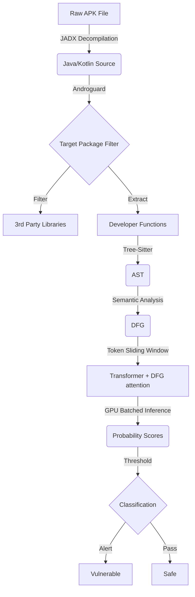

# Does Structure Matter?
### An Empirical Study of Data Flow Graphs in Transformers for Decompiled Android Bytecode

An end-to-end vulnerability detection system for Android applications, and a large-scale
empirical study of whether Data Flow Graph augmentation helps code transformers (CodeBERT,
GraphCodeBERT, UniXcoder) on decompiled bytecode.

> ## 📄 All results, methodology, decisions and limitations live in **[PAPER.md](PAPER.md)**
>
> This README describes the repository and deliberately carries **no numbers**. Keeping results
> in two places is what let six documents drift apart from each other; there is now exactly one
> source of truth. Start at [PAPER.md](PAPER.md) Part 1 for the current status board.

---

## Core finding

**DFG-aware attention provides no consistent benefit over standard text-only transformers on
decompiled Android bytecode.** Across three encoder backbones the effect has no consistent
direction, and every magnitude is comparable to the variation measured across random seeds.

**Why**: JADX decompilation strips meaningful identifier names, replacing them with
machine-generated tokens such as `class_336` and `method_1192`. The DFG edges still exist, but
they connect semantically empty tokens — the graph is structurally present and informationally
empty.

## Contributions

1. **End-to-end Android APK pipeline** — DFG extraction from decompiled bytecode at scale
   across Java, Kotlin and C/C++.
2. **200k DFG-annotated vulnerability corpus** — balanced across four sources, released
   deduplicated.
3. **Informative negative finding with a mechanistic explanation**, grounded in qualitative
   analysis of the model's most confident false negatives.

---

## Pipeline


```mermaid
graph TD
    A[Raw APK File] -->|JADX Decompilation| B(Java/Kotlin Source)
    B -->|Androguard| C{Target Package Filter}
    C -->|Filter| D[3rd Party Libraries]
    C -->|Extract| E[Developer Functions]
    E -->|Tree-Sitter| F(AST)
    F -->|Semantic Analysis| G(DFG)
    G -->|Token Sliding Window| H[Transformer + DFG attention]
    H -->|GPU Batched Inference| I(Probability Scores)
    I -->|Threshold| J{Classification}
    J -->|Alert| K[Vulnerable]
    J -->|Pass| L[Safe]
```

---

## Layout

| Path | Role |
|---|---|
| **[PAPER.md](PAPER.md)** | **single source of truth** — results, methodology, decisions, limitations |
| `dataset/` | the 199,960-entry corpus and its deduplicated release version |
| `dataset_creation_scripts/` | raw APK → JSONL pipeline |
| `training_notebooks/re_train/` | the six training notebooks |
| `new_tests/` | corrected evaluation scripts |
| `new_tests_ran/` | executed training notebooks, with outputs |
| `test_scripts/` | superseded evaluation scripts, plus the APK scanner pipeline |
| `results/` | result files and figures |
| `APKs/` | the APKs used for real-world calibration |

---

## Reproducing

1. **Environment** — a standard Kaggle GPU environment (P100 or T4).
2. **Dataset** — upload `dataset/dataset_graphcodebert.jsonl` to `/kaggle/input/…`, or point the
   `Args.train_file` field in each notebook at your own copy.
3. **Training** — run any notebook in `training_notebooks/re_train/`. Hyperparameters and the
   split are documented in [PAPER.md](PAPER.md) Part 4.
4. **Evaluation** — the scripts in `new_tests/` cover ROC/PR curves, per-source breakdown,
   TF-IDF baselines, imbalanced deployment simulation, qualitative false-negative extraction,
   and McNemar significance testing.

> ⚠️ **The evaluation scripts do not run as-is.** Every checkpoint path is a blank `# TODO`
> placeholder — see [PAPER.md](PAPER.md) §10.4. Fill them in before running anything.

## Requirements

```bash
pip install -r requirements.txt
```
