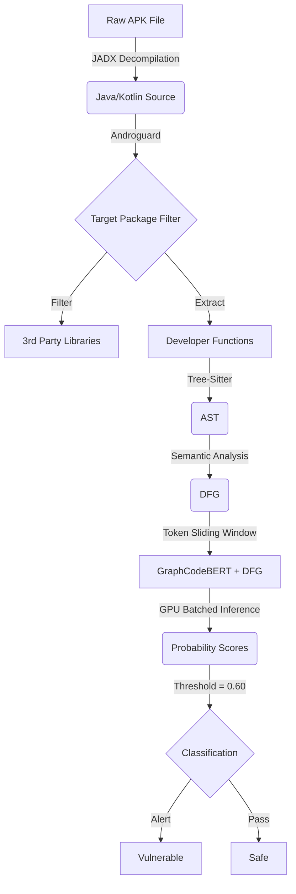
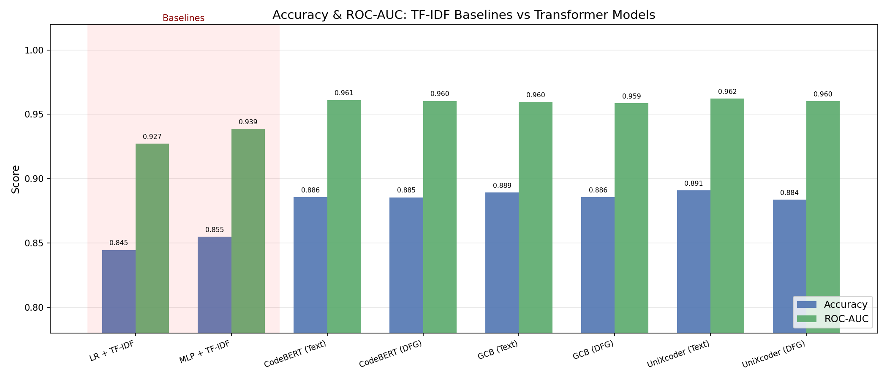
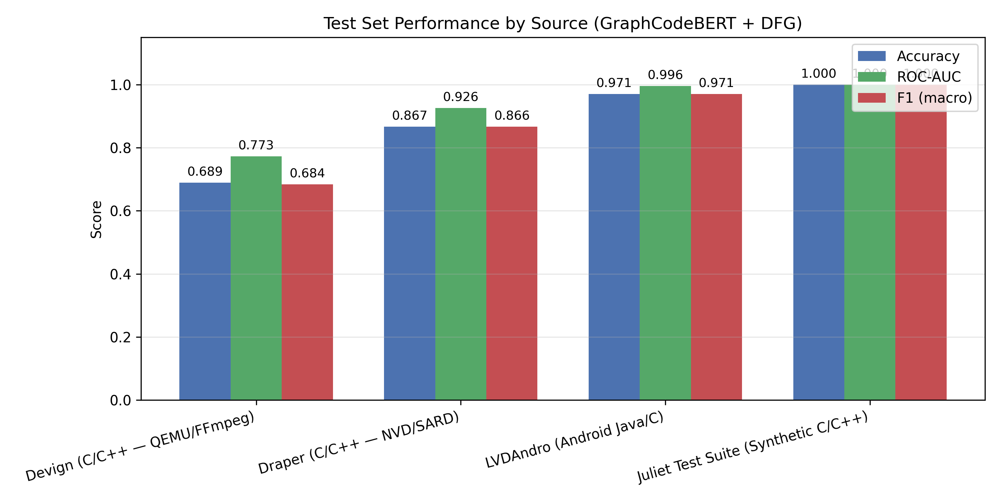
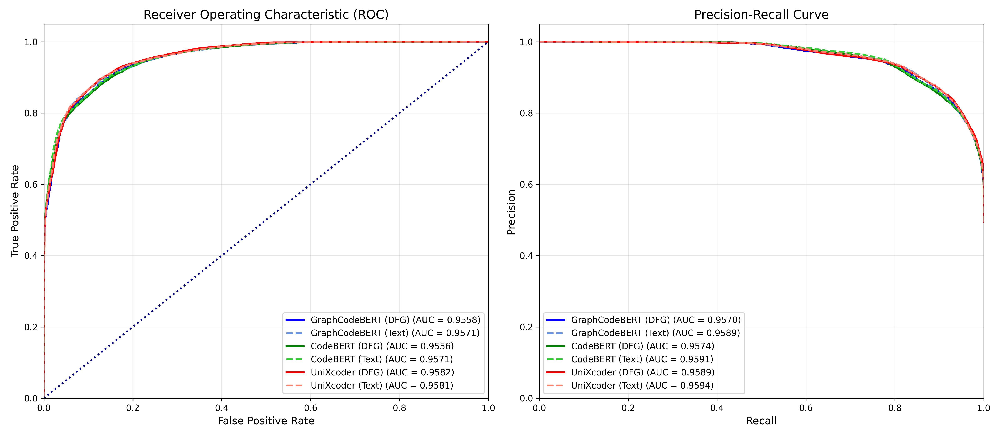
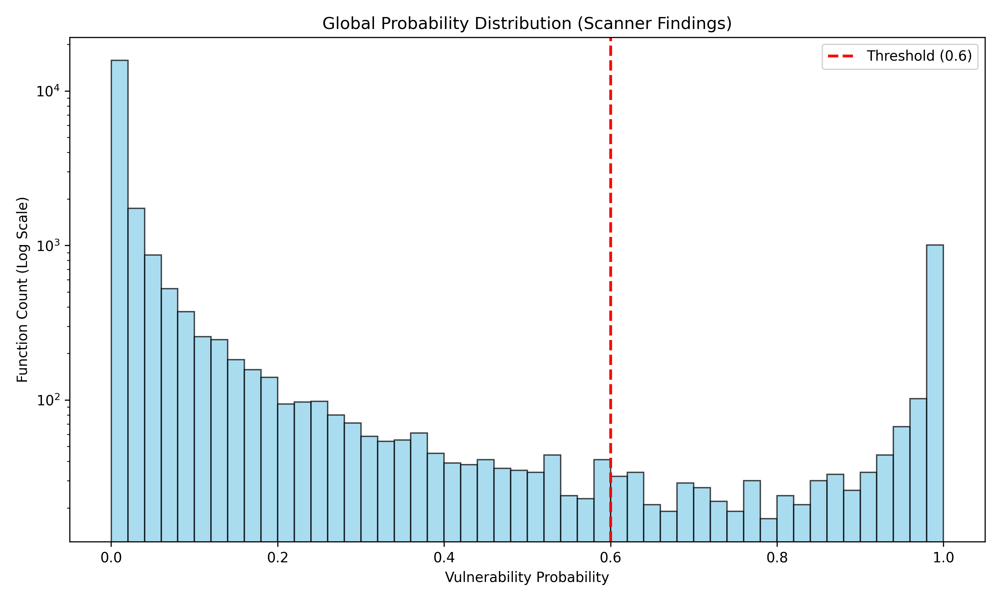
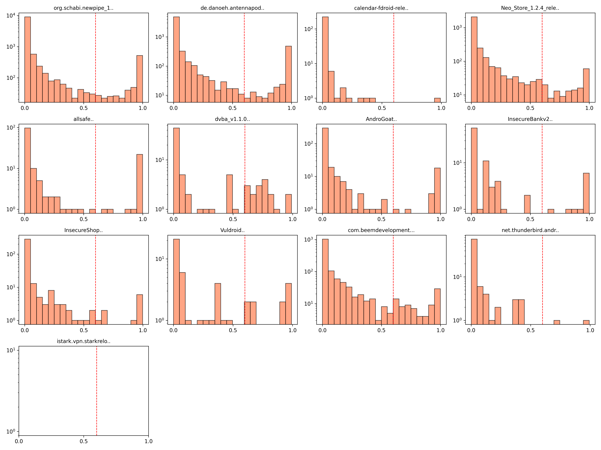

# Does Structure Matter? An Empirical Study of Data Flow Graphs in Transformers for Decompiled Android Malware

This project implements an end-to-end vulnerability detection system for Android applications and conducts a large-scale empirical study investigating the efficacy of Data Flow Graph (DFG) augmentation in Code Transformers (e.g., CodeBERT, GraphCodeBERT, UniXcoder) on decompiled bytecode.

## Core Finding

**DFG-aware attention provides no consistent benefit and universally degrades overall accuracy compared to standard text-only transformers on decompiled Android bytecode.** Across three encoder backbones (CodeBERT, GraphCodeBERT, UniXcoder), structural augmentation slightly reduces accuracy while providing marginal changes to False Negative rates.

**Why**: JADX decompilation strips meaningful identifier names, replacing them with machine-generated tokens such as `class_336` and `method_1192`. DFG edges still exist, but they connect semantically empty tokens, causing the attention mechanisms to overfit on structural noise. Text-only models consistently match or outperform graph-augmented models on the exact same decompiled data.

## Three Genuine Contributions

1. **200k DFG-annotated vulnerability corpus**: The first large-scale, balanced dataset for decompiled Android malware that maps Data Flow Graphs to bytecode.
2. **Systematic Empirical Evaluation**: A rigorous, stratified comparison (82/8/10 split) across three leading code transformers (CodeBERT, GraphCodeBERT, UniXcoder) demonstrating the counter-intuitive failure of structural augmentation.
3. **Mechanistic Explanation**: Qualitative analysis and statistical significance testing (McNemar's) proving that identifier stripping is the root cause of the DFG failure.

---

## Pipeline Architecture

```mermaid
graph TD
    A[Raw APK File] -->|JADX Decompilation| B(Java/Kotlin Source)
    B -->|Androguard| C{Target Package Filter}
    C -->|Filter| D[3rd Party Libraries]
    C -->|Extract| E[Developer Functions]
    E -->|Tree-Sitter| F(AST)
    F -->|Semantic Analysis| G(DFG)
    G -->|Token Sliding Window| H[GraphCodeBERT + DFG]
    H -->|GPU Batched Inference| I(Probability Scores)
    I -->|Threshold = 0.60| J{Classification}
    J -->|Alert| K[Vulnerable]
    J -->|Pass| L[Safe]
```

---

## Training Configuration

| Parameter | Value |
|---|---|
| Split | 82/8/10 train/val/test, seed 42 |
| Epochs | Up to 5 (early stopping, patience = 2) |
| Checkpoint selection | Best validation accuracy |
| Batch size | 16 train / 32 eval |
| Learning rate | 2e-5 |
| Optimizer | AdamW, eps = 1e-8 |
| Gradient clipping | max norm 1.0 |
| Precision | FP16 |
| Code length | 384 tokens |
| Decision threshold | 0.60 |

> **Note**: Models were retrained with an 8% stratified validation split and
> validation-based early stopping (patience = 2, max 5 epochs). Only `graphcodebert-train-dfg`
> was given a higher ceiling (max 10 epochs, patience = 3); the other five runs use 5 / 2.
> The original methodology used a fixed 3-epoch schedule with no checkpoint selection.

> ⚠️ **Planned change — raising the epoch ceiling (decided 2026-08-04).** Two runs selected
> their best checkpoint on the *final* epoch with validation accuracy still rising, so their
> reported numbers are floors rather than converged values:
>
> | Run | Ceiling | Best epoch | Validation trajectory |
> |---|:---:|:---:|---|
> | `codebert-train-text` | 5 | **5** | 86.64 → 87.84 → 88.09 → 88.26 → **88.31** |
> | `graphcodebert-train-text-only` | 5 | **5** | 86.45 → 87.90 → 88.71 → 88.86 → **89.04** |
>
> Both will be retrained with a higher ceiling so early stopping, rather than the epoch cap,
> decides when training ends. Table 1, Table 2 and Table 3 are provisional until then. See
> [REMEDIATION_PLAN.md](REMEDIATION_PLAN.md) §5.3.

---

## Results

### Table 1 - Full Model Comparison

| Model | Backbone | Structure | Accuracy | ROC-AUC | PR-AUC | FN | FP | Best Epoch |
|---|---|---|:---:|:---:|:---:|:---:|:---:|:---:|
| LR + TF-IDF | - | None | 84.4519% | 0.9271 | 0.9270 | 1,685 | - | - |
| MLP + TF-IDF | - | None | 85.4821% | 0.9385 | 0.9408 | 1,425 | - | - |
| CodeBERT | codebert-base | Text only | 88.5627% | 0.9610 | 0.9625 | 1,180 | 1,107 | 4 |
| CodeBERT + DFG | codebert-base | DFG attn | 88.5427% | 0.9604 | 0.9622 | 1,248 | 1,043 | 4 |
| **GCB (text-only)** | graphcodebert | Text only | **88.9300%** | **0.9596** | **0.9611** | **1,241** | **972** | **5** |
| GCB + DFG | graphcodebert | DFG attn | 88.5600% | 0.9585 | 0.9597 | 1,196 | 1,091 | 5 |
| UniXcoder | unixcoder-base | Text only | 89.0778% | 0.9622 | 0.9636 | 1,238 | 946 | 4 |
| UniXcoder + DFG | unixcoder-base | DFG attn | 88.3727% | 0.9602 | 0.9612 | 1,125 | 1,200 | 4 |

Test set: 19,996 held-out samples.

### Table 2 - DFG Effect Per Backbone

| Backbone | Text-only | DFG-aware | Delta Accuracy | Delta FN | McNemar p-value | Verdict |
|---|:---:|:---:|:---:|:---:|:---:|---|
| CodeBERT | 88.5627% | 88.5427% | −0.020% | +68 | p=0.0565 | Not significant |
| GraphCodeBERT | 88.9300% | 88.5600% | −0.370% | −45 | p=0.2496 | Not significant |
| UniXcoder | 89.0778% | 88.3727% | −0.705% | −113 | p=1.0000 | Not significant |

None of the within-backbone DFG comparisons is statistically significant (McNemar's test, all p > 0.05).

### Table 2b - Cross-Architecture Significance Checks

| Comparison | Delta Accuracy | McNemar p-value | Verdict |
|---|:---:|:---:|---|
| GCB+DFG vs CodeBERT+DFG | −4.546% | p≈0.0000 | **Significant** |
| GCB+DFG vs UniXcoder+DFG | −0.500% | p=0.0121 | **Significant** |

Raw significance details are saved in `results/test8_significance_results.txt`.

### Table 3 - Training Stability (Multi-Seed)

GraphCodeBERT text-only retrained from identical pretrained encoder across 3 seeds:

| Seed | Accuracy | ROC-AUC | PR-AUC | F1 (macro) |
|:---:|:---:|:---:|:---:|:---:|
| 42 | 88.8278% | 0.9588 | 0.9596 | 0.8883 |
| 123 | 88.8928% | 0.9609 | 0.9625 | 0.8889 |
| 2025 | 89.0728% | 0.9596 | 0.9617 | 0.8907 |
| **mean ± std** | **88.93% ± 0.10%** | **0.9598 ± 0.0009** | **0.9613 ± 0.0012** | **0.8893 ± 0.0010** |

### Table 4 - Per-Source Breakdown

| Source | N | Accuracy | ROC-AUC | F1 | FN |
|---|:---:|:---:|:---:|:---:|:---:|
| **LVDAndro** | 7,500 | **97.0667%** | **0.9957** | **0.9707** | **133** |
| Draper | 7,500 | 86.6667% | 0.9264 | 0.8664 | 303 |
| Juliet | 2,500 | 100.0000% | 1.0000 | 1.0000 | 0 |
| Devign | 2,496 | 68.9103% | 0.7729 | 0.6844 | 222 |

### Table 5 - Deployment Threshold (Imbalanced 90/10)

Evaluated under deployment-realistic 90% safe / 10% malicious class ratio at threshold 0.5:

| Model | Condition | Accuracy | Recall | F1 | FPR | FN |
|---|---|:---:|:---:|:---:|:---:|:---:|
| GCB+DFG | balanced 50/50 | 94.59% | 94.48% | 0.9459 | 5.31% | 552 |
| GCB+DFG | **imbalanced 90/10** | **94.64%** | **94.14%** | **0.7782** | **5.31%** | **65** |
| Ensemble | balanced 50/50 | 94.58% | 94.93% | 0.9460 | 5.78% | 507 |
| Ensemble | **imbalanced 90/10** | **94.27%** | **94.68%** | **0.7675** | **5.78%** | **59** |

### ROC and PR Curves

### Real-World APK Scanner Calibration

Calibration was re-run with the standalone script `test_9_scanner_calibration.py`
across all downloaded scanner reports.

| Aggregate metric | Value |
|---|---:|
| APK reports analysed | 13 |
| Total functions | 23,005 |
| Confidently safe (< 0.10) | 84.0% |
| Uncertain (0.10 – 0.60) | 8.9% |
| Flagged (≥ 0.60) | 7.1% |
| Highly confident vuln (> 0.90) | 5.5% |

The distribution is sharply concentrated near 0.0 with a small high-confidence tail rather
than being flat or centered near 0.5.

| APK | Type | Functions | Flagged | Rate |
|---|---|:---:|:---:|:---:|
| allsafe | Safe test app | 149 | 26 | 17.4% |
| AndroGoat | Deliberately vulnerable | 371 | 23 | 6.2% |
| calendar-fdroid-release | FOSS app | 236 | 1 | 0.4% |
| com.beemdevelopment.aegis | FOSS 2FA | 1,428 | 84 | 5.9% |
| de.danoeh.antennapod | FOSS podcast | 6,169 | 576 | 9.3% |
| dvba_v1.1.0 | Deliberately vulnerable | 77 | 16 | 20.8% |
| InsecureBankv2 | Deliberately vulnerable | 88 | 10 | 11.4% |
| InsecureShop | Intentionally vulnerable | 336 | 10 | 3.0% |
| istark.vpn.starkreloaded | Commercial APK sample | 0 | 0 | 0.0% |
| Neo_Store_1.2.4_release | FOSS app | 2,939 | 153 | 5.2% |
| net.thunderbird.android_20 | FOSS email | 95 | 2 | 2.1% |
| org.schabi.newpipe_1008_cb84069 | FOSS media | 11,070 | 728 | 6.6% |
| Vuldroid | Deliberately vulnerable | 47 | 10 | 21.3% |

### False Negative Pattern Classification

| Pattern | Description | Count (top-20) |
|---|---|:---:|
| P5a | Full machine-generated obfuscation | 5 |
| P1 | Structural fragmentation | 4 |
| P5b | Kotlin/lambda synthetic obfuscation | 3 |
| P7 | Inter-procedural access patterns | 3 |
| P2 | Benign surface appearance | 2 |
| P3 | Arithmetic edge case | 1 |
| P6 | Flag/control flow logic | 1 |
| P4 | Android API semantic bypass | 1 |

---

## Project Structure

| File | Role |
|---|---|
| `codebert_final_train.ipynb` | Standardized CodeBERT training (90/10 split) |
| `graphcodebert_final_train.ipynb` | Standardized GraphCodeBERT training (90/10 split) |
| `unixcoder_final_train.ipynb` | Standardized UniXcoder training (90/10 split) |
| `regvd_final_train.ipynb` | Standardized ReGVD (GCB backbone) training (90/10 split) |
| `unixcoder_dfg_final_train.ipynb` | Standardized UniXcoder + DFG attention training (90/10 split) |
| `scanner-pipeline-final.ipynb` | End-to-end APK decompilation, DFG parsing, and inference |
| `dfg-generation.ipynb` | Standalone DFG generation and dataset inspection |
| `dataset_creation_scripts/` | Pipeline for raw APK to JSONL dataset conversion |
| `test_scripts/` | Evaluation python scripts (ROC-AUC, Stability, Calibration) |
| `results/` | Final experimental plots and classification reports |
| `requirements.txt` | Python dependencies |

---

## Reproducing Results

1. **Environment Setup**: Standard Kaggle GPU (P100 or T4) environment is recommended.
2. **Dataset**: Upload `dataset_graphcodebert.jsonl` to `/kaggle/input/...` or update the `Args` class in the training notebooks.
3. **Training**: Execute any training notebook from `training_notebooks/re_train/`. They use:
   - **Split**: 82/8/10 train/val/test (stratified by source, seed=42).
   - **Epochs**: Up to 5 (early stopping, patience=2; `graphcodebert-train-dfg` only: max 10,
     patience=3). Being raised for the two runs that hit the ceiling still improving — see the
     Training Configuration note above.
   - **Hyperparameters**: batch size 16, lr 2e-5, AdamW, linear warmup, FP16 autocast.
4. **Evaluation**: All evaluation is standardized into Python scripts in the `test_scripts/` directory:
   - **`test-2-roc-auc.py`**: Generates the grand ROC comparison. **Inputs**: ALL 6 model checkpoints (CodeBERT Text/DFG, GCB Text/DFG, UniXcoder Text/DFG).
   - **`test_3_multiseed.py`**: Measures training stability (± margin). **Inputs**: UniXcoder Text-only (or any primary baseline).
   - **`test_4_per_source.py`**: Breaks down accuracy by dataset. **Inputs**: UniXcoder Text-only.
   - **`test_5_mlp_baseline.py`**: TF-IDF baseline. **Inputs**: None.
   - **`test_6_imbalanced_eval.py`**: Simulates a 90% safe / 10% malicious deployment. **Inputs**: UniXcoder Text-only & UniXcoder+DFG.
   - **`test_7_qualitative_analysis.py`**: Extracts Top False Negatives. **Inputs**: UniXcoder+DFG.
   - **`test_8_significance_testing.py`**: McNemar's tests. **Inputs**: None (reads `.npy` files from Test 2).
   - **`test_9_scanner_calibration.py`**: Graphical calibration test on real-world APKs. **Inputs**: None (reads `*_vuln_report.json` files generated by the scanner).
