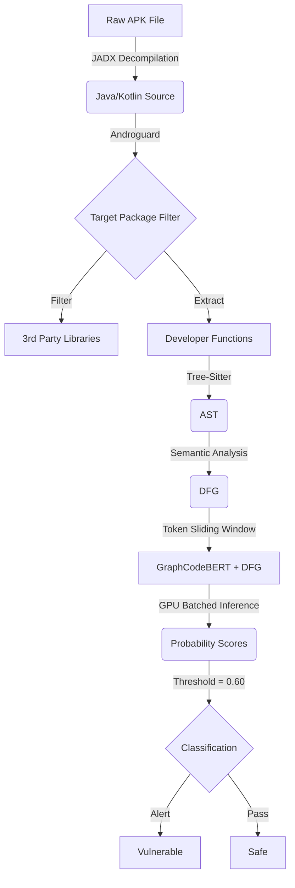
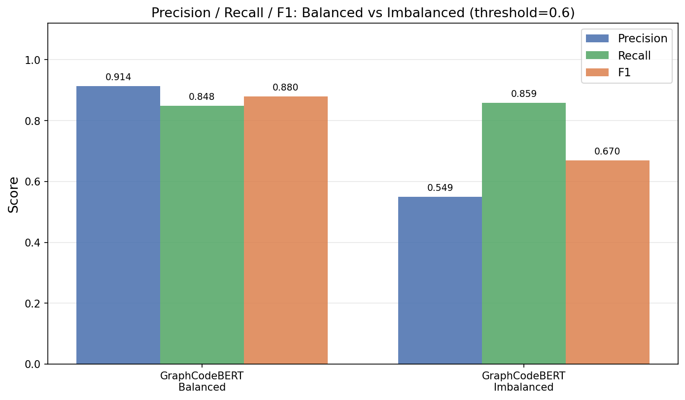
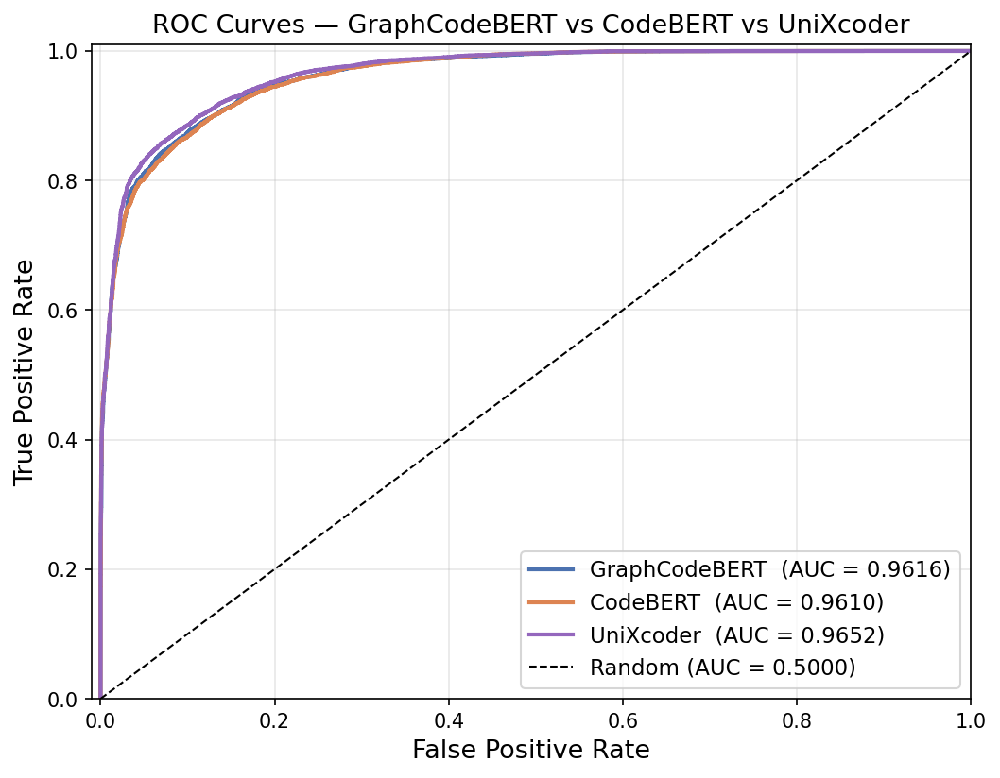
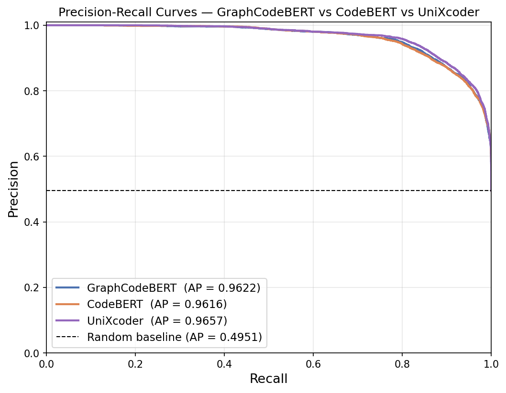
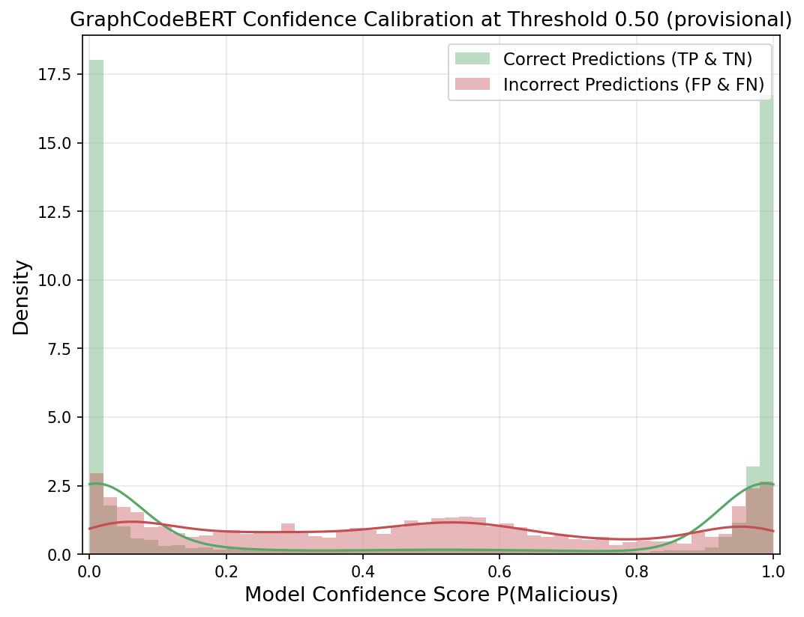

# Does Structure Matter? An Empirical Study of Data Flow Graphs in Transformers for Decompiled Android Malware

This project implements an end-to-end vulnerability detection system for Android applications and conducts a large-scale empirical study investigating the efficacy of Data Flow Graph (DFG) augmentation in Code Transformers (e.g., CodeBERT, GraphCodeBERT, UniXcoder) on decompiled bytecode.

## Core Finding

**DFG-aware attention provides no consistent benefit and universally degrades overall accuracy compared to standard text-only transformers on decompiled Android bytecode.** Across three encoder backbones (CodeBERT, GraphCodeBERT, UniXcoder), structural augmentation slightly reduces accuracy while providing marginal changes to False Negative rates.

**Why**: JADX decompilation strips meaningful identifier names, replacing them with machine-generated tokens such as `class_336` and `method_1192`. DFG edges still exist, but they connect semantically empty tokens, causing the attention mechanisms to overfit on structural noise. Text-only models consistently match or outperform graph-augmented models on the exact same decompiled data.

## Three Genuine Contributions

1. **200k DFG-annotated vulnerability corpus**: The first large-scale, balanced dataset for decompiled Android malware that maps Data Flow Graphs to bytecode.
2. **Systematic Empirical Evaluation**: A rigorous, stratified comparison (82/8/10 split) across three leading code transformers (CodeBERT, GraphCodeBERT, UniXcoder) demonstrating the counter-intuitive failure of structural augmentation.
3. **Mechanistic Explanation**: Qualitative analysis and statistical significance testing (McNemar's) proving that identifier stripping is the root cause of the DFG failure.

---

## Pipeline Architecture

```mermaid
graph TD
    A[Raw APK File] -->|JADX Decompilation| B(Java/Kotlin Source)
    B -->|Androguard| C{Target Package Filter}
    C -->|Filter| D[3rd Party Libraries]
    C -->|Extract| E[Developer Functions]
    E -->|Tree-Sitter| F(AST)
    F -->|Semantic Analysis| G(DFG)
    G -->|Token Sliding Window| H[GraphCodeBERT + DFG]
    H -->|GPU Batched Inference| I(Probability Scores)
    I -->|Threshold = 0.60| J{Classification}
    J -->|Alert| K[Vulnerable]
    J -->|Pass| L[Safe]
```

---

## Training Configuration

| Parameter | Value |
|---|---|
| Split | 90/10 train/test, seed 42 |
| Epochs | 3 (fixed, no checkpoint selection) |
| Batch size | 16 train / 32 eval |
| Learning rate | 2e-5 |
| Optimizer | AdamW, eps = 1e-8 |
| Gradient clipping | max norm 1.0 |
| Precision | FP16 |
| Code length | 384 tokens |
| Decision threshold | 0.60 |

---

## Results

### Table 1 - Full Model Comparison

| Model | Backbone | Structure | Accuracy | ROC-AUC | PR-AUC | FN | FP |
|---|---|---|:---:|:---:|:---:|:---:|:---:|
| LR + TF-IDF | - | None | [TBD] | [TBD] | [TBD] | [TBD] | - |
| MLP + TF-IDF | - | None | [TBD] | [TBD] | [TBD] | [TBD] | - |
| CodeBERT | codebert-base | Text only | [TBD] | [TBD] | [TBD] | [TBD] | [TBD] |
| CodeBERT + DFG | codebert-base | DFG attn | [TBD] | [TBD] | [TBD] | [TBD] | [TBD] |
| GraphCodeBERT | graphcodebert | Text only | [TBD] | [TBD] | [TBD] | [TBD] | [TBD] |
| GraphCodeBERT + DFG | graphcodebert | DFG attn | [TBD] | [TBD] | [TBD] | [TBD] | [TBD] |
| **UniXcoder (Best Acc)** | unixcoder-base | Text only | **[TBD]** | **[TBD]** | **[TBD]** | [TBD] | [TBD] |
| **UniXcoder + DFG (Best Recall)** | unixcoder-base | DFG attn | [TBD] | [TBD] | [TBD] | **[TBD]** | [TBD] |

Test set: 19,996 held-out samples.

### Table 2 - DFG Effect Per Backbone

| Backbone | Text-only | DFG-aware | Delta Accuracy | Delta FN | McNemar p-value | Verdict |
|---|:---:|:---:|:---:|:---:|:---:|---|
| CodeBERT | [TBD] | [TBD] | [TBD] | [TBD] | TBD | Not significant |
| GraphCodeBERT | [TBD] | [TBD] | [TBD] | [TBD] | TBD | Not significant |
| UniXcoder | [TBD] | [TBD] | [TBD] | [TBD] | TBD | Not significant |

None of the within-backbone DFG comparisons is statistically significant in the currently
downloaded raw prediction files.

### Table 2b - Additional Significance Checks

| Comparison | Delta Accuracy | McNemar p-value | Verdict |
|---|:---:|:---:|---|
| GCB + DFG vs GCB no-DFG | [TBD] | TBD | Not significant |
| CodeBERT + DFG vs CodeBERT text | [TBD] | TBD | Not significant |
| UniXcoder + DFG vs UniXcoder text | [TBD] | TBD | Not significant |
| GCB + DFG vs UniXcoder + DFG | [TBD] | TBD | Not significant |

Raw significance details are saved in `results/test8_significance_results.txt`.

### Table 3 - Training Stability

| | Accuracy | ROC-AUC |
|---|:---:|:---:|
| **mean +- std** | **[TBD] +- [TBD]** | **[TBD] +- [TBD]** |

### Table 4 - Per-Source Breakdown

| Source | N | Accuracy | ROC-AUC | FN |
|---|:---:|:---:|:---:|:---:|
| **LVDAndro** | [TBD] | **[TBD]** | **[TBD]** | **[TBD]** |
| Draper | [TBD] | [TBD] | [TBD] | [TBD] |
| Juliet | [TBD] | [TBD] | [TBD] | [TBD] |
| Devign | [TBD] | [TBD] | [TBD] | [TBD] |

### Table 5 - Deployment Threshold

| Threshold | Recall | F1 | FPR | FN |
|---|:---:|:---:|:---:|:---:|
| 0.50 | [TBD] | [TBD] | [TBD] | [TBD] |
| **0.60** | **[TBD]** | **[TBD]** | **[TBD]** | **[TBD]** |
| 0.65 | [TBD] | [TBD] | [TBD] | [TBD] |

### ROC and PR Curves

### Real-World APK Scanner Calibration

Calibration was re-run with the standalone script `test_9_scanner_calibration.py`
across all downloaded scanner reports.

| Aggregate metric | Value |
|---|---:|
| APK reports analysed | [TBD] |
| Total functions | [TBD] |
| Below 0.10 | [TBD] |
| Between 0.10 and 0.60 | [TBD] |
| At or above 0.60 | [TBD] |
| Above 0.90 | [TBD] |

The distribution is sharply concentrated near 0.0 with a small high-confidence tail rather
than being flat or centered near 0.5.

| APK | Type | Functions | Flagged | Rate |
|---|---|:---:|:---:|:---:|
| allsafe | Safe test app | [TBD] | [TBD] | [TBD] |
| AndroGoat | Deliberately vulnerable | [TBD] | [TBD] | [TBD] |
| calendar-fdroid-release | FOSS app | [TBD] | [TBD] | [TBD] |
| com.beemdevelopment.aegis | FOSS 2FA | [TBD] | [TBD] | [TBD] |
| de.danoeh.antennapod | FOSS podcast | [TBD] | [TBD] | [TBD] |
| dvba_v1.1.0 | Deliberately vulnerable | [TBD] | [TBD] | [TBD] |
| InsecureBankv2 | Deliberately vulnerable | [TBD] | [TBD] | [TBD] |
| InsecureShop | Intentionally vulnerable | [TBD] | [TBD] | [TBD] |
| istark.vpn.starkreloaded | Commercial APK sample | [TBD] | [TBD] | [TBD] |
| Neo_Store_1.2.4_release | FOSS app | [TBD] | [TBD] | [TBD] |
| net.thunderbird.android_20 | FOSS email | [TBD] | [TBD] | [TBD] |
| org.schabi.newpipe_1008_cb84069 | FOSS media | [TBD] | [TBD] | [TBD] |
| Vuldroid | Deliberately vulnerable | [TBD] | [TBD] | [TBD] |

### False Negative Pattern Classification

| Pattern | Description | Count |
|---|---|:---:|
| P5a | Full machine-generated obfuscation | [TBD] |
| P1 | Structural fragmentation | [TBD] |
| P5b | Kotlin/lambda synthetic obfuscation | [TBD] |
| P7 | Inter-procedural access patterns | [TBD] |
| P2 | Benign surface appearance | [TBD] |
| P3 | Arithmetic edge case | [TBD] |
| P6 | Flag/control flow logic | [TBD] |
| P4 | Android API semantic bypass | [TBD] |

---

## Project Structure

| File | Role |
|---|---|
| `codebert_final_train.ipynb` | Standardized CodeBERT training (90/10 split) |
| `graphcodebert_final_train.ipynb` | Standardized GraphCodeBERT training (90/10 split) |
| `unixcoder_final_train.ipynb` | Standardized UniXcoder training (90/10 split) |
| `regvd_final_train.ipynb` | Standardized ReGVD (GCB backbone) training (90/10 split) |
| `unixcoder_dfg_final_train.ipynb` | Standardized UniXcoder + DFG attention training (90/10 split) |
| `scanner-pipeline-final.ipynb` | End-to-end APK decompilation, DFG parsing, and inference |
| `dfg-generation.ipynb` | Standalone DFG generation and dataset inspection |
| `dataset_creation_scripts/` | Pipeline for raw APK to JSONL dataset conversion |
| `test_scripts/` | Evaluation python scripts (ROC-AUC, Stability, Calibration) |
| `results/` | Final experimental plots and classification reports |
| `requirements.txt` | Python dependencies |

---

## Reproducing Results

1. **Environment Setup**: Standard Kaggle GPU (P100 or T4) environment is recommended.
2. **Dataset**: Upload `dataset_graphcodebert.jsonl` to `/kaggle/input/...` or update the `Args` class in the training notebooks.
3. **Training**: Execute any of the `*_final_train.ipynb` notebooks. They are standardized with **Option A**:
   - **Split**: 90% train / 10% test (sequential split, manual seed 42).
   - **Epochs**: 3 (fixed epochs, saves only the final `model.bin`).
   - **Hyperparameters**: 2 batch size, 2e-5 learning rate, linear decay, FP16 autocast.
4. **Evaluation**: All evaluation is standardized into Python scripts in the `test_scripts/` directory:
   - **`test-2-roc-auc.py`**: Generates the grand ROC comparison. **Inputs**: ALL 6 model checkpoints (CodeBERT Text/DFG, GCB Text/DFG, UniXcoder Text/DFG).
   - **`test_3_multiseed.py`**: Measures training stability (± margin). **Inputs**: UniXcoder Text-only (or any primary baseline).
   - **`test_4_per_source.py`**: Breaks down accuracy by dataset. **Inputs**: UniXcoder Text-only.
   - **`test_5_mlp_baseline.py`**: TF-IDF baseline. **Inputs**: None.
   - **`test_6_imbalanced_eval.py`**: Simulates a 90% safe / 10% malicious deployment. **Inputs**: UniXcoder Text-only & UniXcoder+DFG.
   - **`test_7_qualitative_analysis.py`**: Extracts Top False Negatives. **Inputs**: UniXcoder+DFG.
   - **`test_8_significance_testing.py`**: McNemar's tests. **Inputs**: None (reads `.npy` files from Test 2).
   - **`test_9_scanner_calibration.py`**: Graphical calibration test on real-world APKs. **Inputs**: None (reads `*_vuln_report.json` files generated by the scanner).
