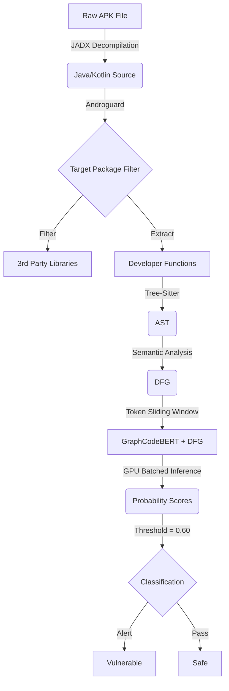

# Android APK Vulnerability Detection - Empirical Study

This project implements an end-to-end vulnerability detection system for Android applications
using **GraphCodeBERT with DFG-aware attention**, and conducts a large-scale empirical study
of whether graph structure benefits vulnerability detection on decompiled bytecode.

## Core Finding

**DFG-aware attention consistently degrades performance over standard transformer encoding
on decompiled Android bytecode.** Across three encoder backbones (CodeBERT, GraphCodeBERT,
UniXcoder), DFG augmentation uniformly hurts accuracy (−0.02%, −0.37%, −0.71% respectively).
All transformer models converge to roughly the same 88–89% accuracy band regardless of structure.

**Why**: JADX decompilation strips meaningful identifier names, replacing them with
machine-generated tokens such as `class_336` and `method_1192`. DFG edges still exist,
but they connect semantically empty tokens. Text-only models therefore match or outperform
graph-augmented models on the same data.

## Three Genuine Contributions

1. **End-to-end Android APK pipeline**: first published system for DFG extraction from
   decompiled bytecode at scale across Java, Kotlin, and C/C++.
2. **200k DFG-annotated vulnerability corpus**: a large balanced dataset that does not
   currently exist elsewhere in public form.
3. **Negative DFG finding with mechanistic explanation**: a clearly negative result supported
   by controlled ablation, qualitative analysis of false negatives, and consistent
   cross-backbone replication.

---

## Pipeline Architecture

---

## Training Configuration

| Parameter | Value |
|---|---|
| Split | 82/8/10 train/val/test, seed 42 |
| Epochs | Up to 5 (early stopping, patience = 2) |
| Checkpoint selection | Best validation accuracy |
| Batch size | 16 train / 32 eval |
| Learning rate | 2e-5 |
| Optimizer | AdamW, eps = 1e-8 |
| Gradient clipping | max norm 1.0 |
| Precision | FP16 |
| Code length | 384 tokens |
| Decision threshold | 0.60 |

> **Note**: Models were retrained with an 8% stratified validation split and
> validation-based early stopping (patience = 2). The original methodology used a
> fixed 3-epoch schedule with no checkpoint selection.

---

## Results

### Table 1 - Full Model Comparison

| Model | Backbone | Structure | Accuracy | ROC-AUC | PR-AUC | FN | FP | Best Epoch |
|---|---|---|:---:|:---:|:---:|:---:|:---:|:---:|
| LR + TF-IDF | - | None | 84.50% | 0.9277 | 0.9227 | 1,615 | - | - |
| MLP + TF-IDF | - | None | 85.58% | 0.9393 | 0.9374 | 1,298 | - | - |
| CodeBERT | codebert-base | Text only | 88.5627% | 0.9610 | 0.9625 | 1,180 | 1,107 | 4 |
| CodeBERT + DFG | codebert-base | DFG attn | 88.5427% | 0.9604 | 0.9622 | 1,248 | 1,043 | 4 |
| **GCB (text-only)** | graphcodebert | Text only | **88.9300%** | **0.9596** | **0.9611** | **1,241** | **972** | **5** |
| GCB + DFG | graphcodebert | DFG attn | 88.5600% | 0.9585 | 0.9597 | 1,196 | 1,091 | 5 |
| UniXcoder | unixcoder-base | Text only | 89.0778% | 0.9622 | 0.9636 | 1,238 | 946 | 4 |
| UniXcoder + DFG | unixcoder-base | DFG attn | 88.3727% | 0.9602 | 0.9612 | 1,125 | 1,200 | 4 |

Test set: 19,996 held-out samples.

### Table 2 - DFG Ablation

| Condition | Accuracy | ROC-AUC | PR-AUC | FN |
|---|:---:|:---:|:---:|:---:|
| GraphCodeBERT + DFG | 88.5600% | 0.9585 | 0.9597 | 1,196 |
| GraphCodeBERT (no DFG) | 88.9300% | 0.9596 | 0.9611 | 1,241 |
| **Delta** | **−0.370%** | **−0.0011** | **−0.0014** | **−45** |

### Table 3 - DFG Effect Per Backbone

| Backbone | Text-only | DFG-aware | Delta Accuracy | Delta FN | Verdict |
|---|:---:|:---:|:---:|:---:|---|
| CodeBERT | 88.5627% | 88.5427% | −0.020% | +68 | DFG hurts (marginal) |
| GraphCodeBERT | 88.9300% | 88.5600% | −0.370% | −45 | DFG hurts |
| UniXcoder | 89.0778% | 88.3727% | −0.705% | −113 | DFG hurts |

DFG-aware attention degrades accuracy for all three backbones. The effect is marginal for
CodeBERT but substantial for GraphCodeBERT (−0.37%) and UniXcoder (−0.71%).

### Table 4 - Training Stability

> ⚠️ The multi-seed stability test (Test 4) needs to be re-run under the new
> validation-based early stopping methodology. Numbers below are from the original run
> and are stale.

| | Accuracy | ROC-AUC |
|---|:---:|:---:|
| **mean ± std (original)** | **87.53% ± 0.11%** | **0.9565 ± 0.0003** |

### Table 5 - Per-Source Breakdown

> ⚠️ Per-source breakdown (Test 5) needs to be re-run with the retrained models.
> Numbers below are from the original run and are stale.

| Source | N | Accuracy | ROC-AUC | FN |
|---|:---:|:---:|:---:|:---:|
| **LVDAndro** | 7,537 | **98.34%** | **0.9978** | **51** |
| Draper | 7,449 | 89.43% | 0.9507 | 439 |
| Juliet | 2,533 | 100.00% | 1.0000 | 0 |
| Devign | 2,477 | 67.58% | 0.7633 | 449 |

### Table 6 - Deployment Threshold

> ⚠️ Threshold sensitivity (Test 7) needs to be re-run; the optimal threshold may
> have shifted with the new probability distributions.

| Threshold | Recall | F1 | FPR | FN |
|---|:---:|:---:|:---:|:---:|
| 0.50 | 87.24% | 0.6165 | 10.64% | 143 |
| **0.60** | **83.41%** | **0.6585** | **7.77%** | **186** |
| 0.65 | 81.71% | 0.6760 | 6.67% | 205 |

### ROC and PR Curves

### Real-World APK Scanner Calibration

Calibration was re-run with the standalone script `test_c_calibration_newmodel.py`
across all downloaded scanner reports.

| Aggregate metric | Value |
|---|---:|
| APK reports analysed | 13 |
| Total functions | 23,005 |
| Below 0.10 | 89.2% |
| Between 0.10 and 0.60 | 5.2% |
| At or above 0.60 | 5.6% |
| Above 0.90 | 4.1% |

The distribution is sharply concentrated near 0.0 with a small high-confidence tail rather
than being flat or centered near 0.5.

| APK | Type | Functions | Flagged | Rate |
|---|---|:---:|:---:|:---:|
| allsafe | Safe test app | 149 | 20 | 13.4% |
| AndroGoat | Deliberately vulnerable | 371 | 29 | 7.8% |
| calendar-fdroid-release | FOSS app | 236 | 18 | 7.6% |
| com.beemdevelopment.aegis | FOSS 2FA | 1,428 | 73 | 5.1% |
| de.danoeh.antennapod | FOSS podcast | 6,169 | 519 | 8.4% |
| dvba_v1.1.0 | Deliberately vulnerable | 77 | 4 | 5.2% |
| InsecureBankv2 | Deliberately vulnerable | 88 | 10 | 11.4% |
| InsecureShop | Intentionally vulnerable | 336 | 16 | 4.8% |
| istark.vpn.starkreloaded | Commercial APK sample | 0 | 0 | 0.0% |
| Neo_Store_1.2.4_release | FOSS app | 2,939 | 128 | 4.4% |
| net.thunderbird.android_20 | FOSS email | 95 | 8 | 8.4% |
| org.schabi.newpipe_1008_cb84069 | FOSS media | 11,070 | 463 | 4.2% |
| Vuldroid | Deliberately vulnerable | 47 | 5 | 10.6% |

### False Negative Pattern Classification

| Pattern | Description | Count |
|---|---|:---:|
| P5a | Full machine-generated obfuscation | 5 |
| P1 | Structural fragmentation | 4 |
| P5b | Kotlin/lambda synthetic obfuscation | 3 |
| P7 | Inter-procedural access patterns | 3 |
| P2 | Benign surface appearance | 2 |
| P3 | Arithmetic edge case | 1 |
| P6 | Flag/control flow logic | 1 |
| P4 | Android API semantic bypass | 1 |

> ⚠️ The qualitative FN analysis (Test 8) needs to be re-run. FN counts and the
> pattern distribution above may change with the new model's prediction set.

---

## Project Structure

| File | Role |
|---|---|
| `codebert_final_train.ipynb` | CodeBERT training (82/8/10 split, early stopping) |
| `graphcodebert_final_train.ipynb` | GraphCodeBERT training (82/8/10 split, early stopping) |
| `unixcoder_final_train.ipynb` | UniXcoder training (82/8/10 split, early stopping) |
| `unixcoder_dfg_final_train.ipynb` | UniXcoder + DFG attention training (82/8/10 split, early stopping) |
| `scanner-pipeline-final.ipynb` | End-to-end APK decompilation, DFG parsing, and inference |
| `dfg-generation.ipynb` | Standalone DFG generation and dataset inspection |
| `dataset_creation_scripts/` | Pipeline for raw APK to JSONL dataset conversion |
| `test_notebooks/` | Evaluation notebooks (ROC-AUC, Ablation, Stability, etc.) |
| `results/` | Final experimental plots and classification reports |
| `requirements.txt` | Python dependencies |

---

## Reproducing Results

1. **Environment Setup**: Standard Kaggle GPU (P100 or T4) environment is recommended.
2. **Dataset**: Upload `dataset_graphcodebert.jsonl` to `/kaggle/input/...` or update the `Args` class in the training notebooks.
3. **Training**: Execute any of the `*_final_train.ipynb` notebooks. They use the retrained methodology:
   - **Split**: 82% train / 8% validation / 10% test (stratified, seed 42).
   - **Epochs**: Up to 5, with early stopping (patience = 2) on validation accuracy.
   - **Checkpoint**: Best validation accuracy checkpoint is saved as `model.bin`.
   - **Hyperparameters**: 16 batch size (train), 2e-5 learning rate, linear decay, FP16 autocast.
4. **Evaluation**: After training, the notebooks automatically perform inference on the 10% test samples and output classification metrics (ROC-AUC, PR-AUC, Accuracy).
5. **Ablation & Analysis**: Use the notebooks in `test_notebooks/` for controlled ablation and multi-seed stability checks.
